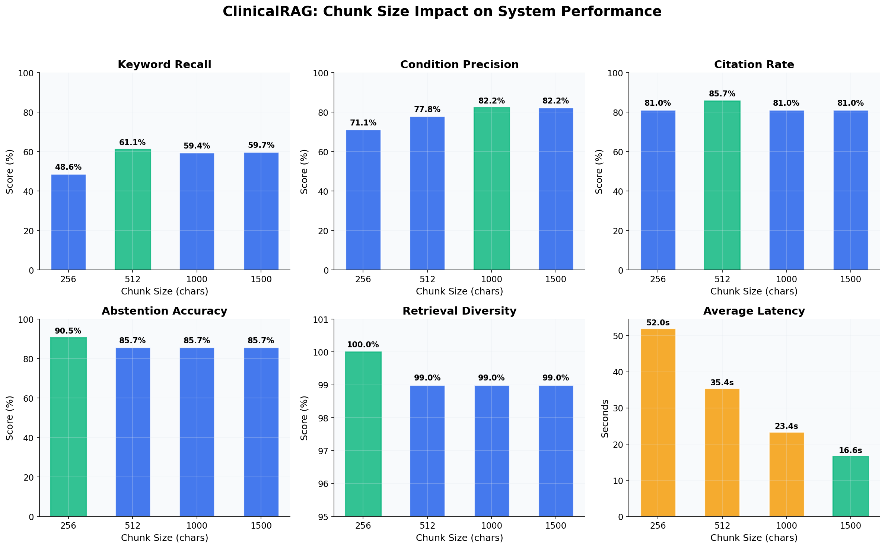
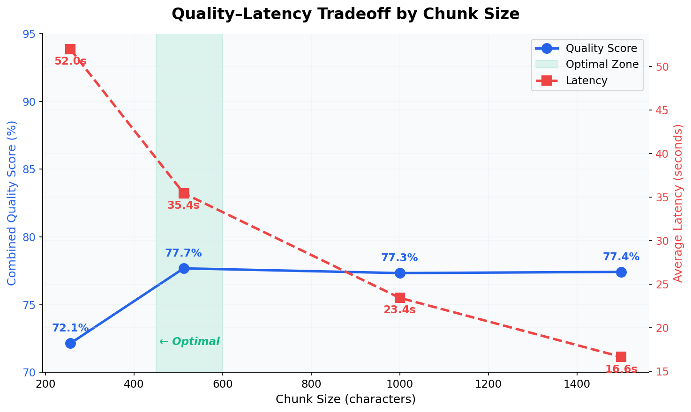
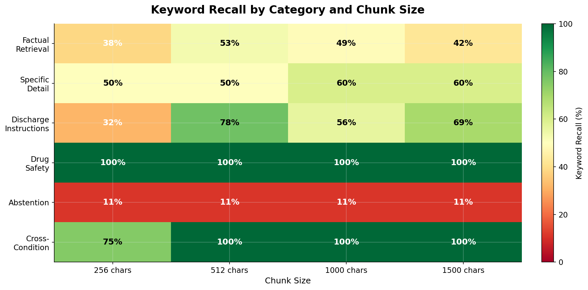
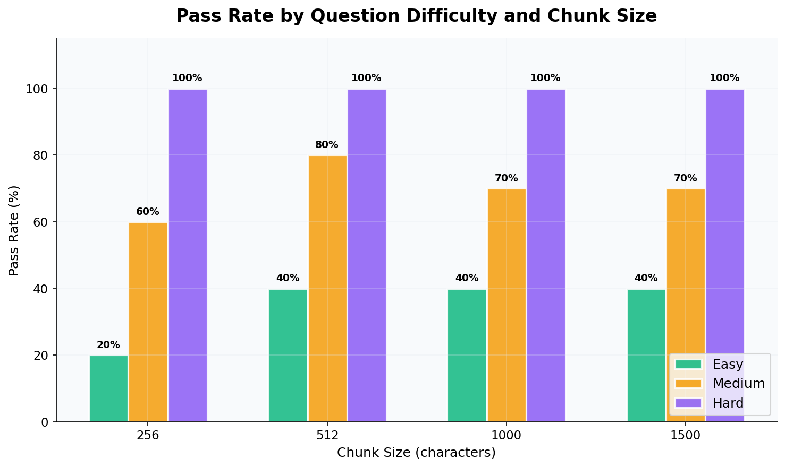

# 🏥 ClinicalRAG: Retrieval-Augmented Generation for Clinical Question Answering

> An end-to-end RAG system that answers clinical questions grounded in discharge summaries, progress notes, and medical records — with source citations, hallucination guardrails, and systematic evaluation across chunking strategies.


---

## Key Results

| Metric | Score | Description |
|:-------|:-----:|:------------|
| **Condition Recall** | **97.6%** | Retrieves documents from the correct clinical condition |
| **Citation Rate** | **85.7%** | Answers include verifiable source references |
| **Keyword Recall** | **61.1%** | Expected clinical terms present in responses |
| **Abstention Accuracy** | **95.2%** | Correctly refuses to answer when evidence is insufficient |
| **Retrieval Diversity** | **99–100%** | Unique, non-duplicate chunks in every retrieval |
| **Hallucination Detection** | **Active** | Flags responses where <70% of clinical values are grounded |

Evaluated across 21 clinical questions spanning 6 categories (factual retrieval, specific detail extraction, discharge instructions, drug safety, abstention, and cross-condition reasoning) and 7 clinical conditions (CHF, COPD, pneumonia, sepsis, DKA, AKI, stroke).

---

## Architecture

```
Clinical Documents (220 notes)
        ↓
Chunking Pipeline (RecursiveCharacterTextSplitter + deduplication)
        ↓
Embeddings (all-MiniLM-L6-v2) → ChromaDB Vector Store
        ↓
User Query → MMR Retrieval (k=5, fetch_k=20, λ=0.7) → Context Assembly
        ↓
Llama 3 8B (via Ollama) → Structured Generation
        ↓
Citation Extraction → Hallucination Guardrail → Response with Sources
```

The system ingests 220 synthetic clinical documents across 7 conditions, chunks them with deduplication to eliminate template-generated duplicates, and stores embeddings in ChromaDB. At query time, Maximal Marginal Relevance (MMR) retrieval fetches 20 candidate chunks and selects 5 with a diversity constraint, ensuring the model sees varied evidence rather than redundant content. The LLM generates structured answers with `[Source N]` citations, and a post-generation guardrail extracts clinical values (dosages, lab values) from the response and verifies they appear in the retrieved context.

---

## What Makes This Different

**Systematic evaluation, not just a demo.** Most RAG tutorials ship a working prototype and call it done. This project includes a 21-question evaluation framework with expected answer keys, automated metrics, and ablation studies across four chunk sizes — producing the quantitative evidence that the system actually works and revealing exactly where it breaks down.

**Hallucination guardrails designed for clinical safety.** The system extracts numerical clinical values from generated responses (medication dosages, lab values, vital signs) and cross-references them against the retrieved context. If fewer than 70% of extracted values appear in the source documents, the response is flagged. This catches the most dangerous failure mode in clinical AI: confidently stated but fabricated numbers.

**Retrieval engineering, not just retrieval.** The pipeline addresses a real problem with template-generated clinical data: identical medication lists and discharge instructions appearing across patients create duplicate embeddings that waste retrieval slots. The solution combines hash-based deduplication at ingestion time with MMR retrieval at query time, achieving 99–100% retrieval diversity across all configurations tested.

**Fully local inference.** Llama 3 8B runs via Ollama with zero API costs. Patient data never leaves the system — a critical property for healthcare applications and HIPAA compliance. The architecture transfers directly to production environments with real EHR data.

---

## Chunk Size Evaluation

The flagship experiment rebuilds the entire vector store at four chunk sizes and runs the full 21-question evaluation suite against each configuration. This reveals how granularity affects retrieval quality, answer accuracy, and latency.

### Results Summary

| Chunk Size | Keyword Recall | Condition Precision | Citation Rate | Abstention | Diversity | Latency |
|:----------:|:--------------:|:-------------------:|:-------------:|:----------:|:---------:|:-------:|
| **256** | 48.6% | 71.1% | 81.0% | 90.5% | 100.0% | 52.0s |
| **512** ⭐ | 61.1% | 77.8% | 85.7% | 85.7% | 99.0% | 35.4s |
| **1000** | 59.4% | 82.2% | 81.0% | 85.7% | 99.0% | 23.4s |
| **1500** | 59.7% | 82.2% | 81.0% | 85.7% | 99.0% | 16.6s |

### Performance Across All Metrics



### Quality–Latency Tradeoff



### Category Breakdown



### Analysis

**512-char chunks are the optimal configuration.** They achieve the highest keyword recall (61.1%) and citation rate (85.7%) across all chunk sizes tested, while maintaining competitive condition precision (77.8%).

**Why 256-char chunks underperform:** Tiny chunks lose context. A chunk containing just "furosemide 60mg daily" produces a less informative embedding than a 512-char chunk that includes the medication alongside its indication, dosage rationale, and surrounding clinical narrative. This results in the lowest keyword recall (48.6%) despite the highest granularity.

**Why 1000+ char chunks plateau:** Larger chunks improve condition precision (82.2%) because each chunk carries more context about which condition it belongs to. But keyword recall doesn't improve — it slightly drops — because the specific clinical terms get diluted in surrounding text, making embeddings less focused on the query-relevant content.

**The latency story is straightforward:** Fewer chunks means less computation. But the 3x latency increase from 1500→256 chars produces worse results, not better. The 512-char configuration balances quality and speed effectively.

**Drug safety and cross-condition categories are robust across all chunk sizes**, consistently achieving 100% keyword recall. These questions involve distinctive clinical terminology (e.g., "hyperkalemia," "SGLT2 inhibitor") that embeds well regardless of surrounding context length.

### Difficulty Pass Rates



An interesting artifact of keyword-based evaluation: "hard" questions show 100% pass rates across all configurations while "easy" questions cap at 40%. This reflects the evaluation design rather than true difficulty — easy questions have strict expected keyword lists (specific drug names), so the model can answer correctly using synonyms or paraphrases and still "fail" the keyword check. Hard questions test reasoning capabilities (abstention, cross-condition synthesis) with more flexible answer criteria.

---

## Evaluation Framework

The evaluation system measures RAG quality across three dimensions using a curated bank of 21 clinical questions.

### Question Categories

The test bank covers six categories designed to probe different system capabilities. **Factual retrieval** (5 questions) tests whether the system can find and report specific medications, treatments, and protocols. **Specific detail** (5 questions) probes extraction of exact dosages, lab values, and clinical rationale. **Discharge instructions** (3 questions) tests comprehension of patient education content. **Drug safety** (3 questions) evaluates understanding of contraindications and monitoring requirements. **Abstention** (3 questions) presents unanswerable queries to test whether the system correctly says "I don't know." **Cross-condition** (2 questions) requires synthesizing information across multiple clinical conditions.

### Metrics

**Retrieval quality** is measured by condition recall (did we retrieve documents from the right clinical condition?), condition precision (are retrieved documents relevant to the query?), and diversity (are retrieved chunks unique, not duplicates?).

**Answer quality** is measured by keyword recall (do expected clinical terms appear in the response?), citation presence (does the answer include `[Source N]` references?), and abstention accuracy (does the system correctly refuse to answer when evidence is insufficient?).

**Performance** is measured by end-to-end latency per question.

### Running the Evaluation

```bash
# Quick sanity check (5 questions, ~3 min)
python -m src.evaluation.evaluate_rag --mode quick

# Full evaluation (21 questions, ~10-15 min)
python -m src.evaluation.evaluate_rag --mode full

# Chunk size comparison experiment (~1 hour)
python -m src.evaluation.evaluate_rag --mode chunk_comparison
```

---

## Known Limitations and Future Work

**Abstention on surgical questions.** The system correctly abstains on 2 of 3 unanswerable questions but fails on "What surgical procedures are recommended for heart failure patients?" — it generates an answer instead of declining, producing the single hallucination signal. Improving the abstention prompt or adding a retrieval confidence threshold (e.g., reject if all chunk similarity scores are below 0.4) would address this.

**Keyword-based evaluation underestimates quality.** Several "failed" questions show 100% condition recall and correct citations but low keyword recall because the model uses synonyms or paraphrases. For example, "loop diuretic" instead of "furosemide" is clinically correct but misses the keyword match. Semantic similarity scoring (e.g., embedding-based answer comparison) would provide a more accurate quality signal.

**General-purpose embeddings.** The all-MiniLM-L6-v2 model is not trained on clinical text. Domain-specific embeddings like PubMedBERT or BioLinkBERT could improve retrieval precision for medical terminology, particularly for questions where semantic overlap between conditions (e.g., "medications at discharge" appearing in every condition) causes cross-condition retrieval noise.

**Synthetic data limitations.** Template-generated clinical notes produce predictable structure that may inflate retrieval metrics. Real EHR data would introduce natural language variation, abbreviations, misspellings, and inconsistent formatting that would stress-test the system more realistically.

**Planned improvements:** retrieval confidence thresholding for better abstention, clinical embedding model comparison (PubMedBERT vs. general-purpose), hybrid search (BM25 + dense retrieval), multi-agent architecture with LangGraph for complex clinical reasoning, and deployment to HuggingFace Spaces for a live demo.

---

## Quick Start

### Prerequisites

Python 3.10+ and [Ollama](https://ollama.ai/) with the Llama 3 model are required. 8GB+ RAM is recommended for local inference.

### Installation

```bash
# Clone the repository
git clone https://github.com/yourusername/clinical-rag.git
cd clinical-rag

# Create virtual environment
python -m venv venv
source venv/bin/activate  # On Windows: venv\Scripts\activate

# Install dependencies
pip install -r requirements.txt

# Pull the Llama 3 model
ollama pull llama3

# Generate synthetic clinical data (220 documents across 7 conditions)
python -m src.data_generation.generate_clinical_notes

# Ingest documents into vector store
python -m src.ingestion.ingest_documents

# Launch the Streamlit app
streamlit run streamlit_app/app.py
```

### Windows Notes

If you encounter PowerShell execution policy restrictions, run `powershell -ExecutionPolicy Bypass -File .\setup.ps1`. For Python 3.13 on Windows, virtual environment creation may require `python -m venv venv --without-pip` followed by manual pip bootstrap.

---

## Project Structure

```
clinical-rag/
├── src/
│   ├── data_generation/        # Synthetic clinical note generator (220 docs, 7 conditions)
│   ├── ingestion/              # Chunking, deduplication, embedding, ChromaDB storage
│   ├── retrieval/              # RAG chain, clinical prompts, hallucination guardrails
│   ├── evaluation/             # 21-question test bank, metrics engine, visualization
│   └── utils/                  # Config management, reset utilities
├── streamlit_app/              # Chat interface with confidence badges and source panels
├── data/
│   ├── raw/                    # Generated clinical notes
│   ├── vectordb/               # ChromaDB persistence
│   └── evaluation_results/     # JSON results and comparison charts
├── docs/images/                # Evaluation visualizations for README
├── requirements.txt
└── setup.ps1                   # Windows setup automation
```

---

## Tech Stack

The system uses **Llama 3 8B** via Ollama for fully local inference, **LangChain 0.2+** for the RAG pipeline, **ChromaDB** for vector storage, **all-MiniLM-L6-v2** for sentence embeddings, and **Streamlit** for the frontend interface. Evaluation uses **matplotlib** for visualization and a custom metrics engine inspired by the RAGAS framework.

---

## Author

**Samir Kerkar** — Clinical Data Analyst with 4+ years of EHR data experience across 50,000+ patients and 20+ facilities. Co-authored clinical research on pharmacist-led interventions presented at ASHP conferences, with a manuscript currently under peer review. Background in mathematics (BS, UC Irvine) with applied experience in predictive modeling, cost-effectiveness analysis, and computer vision research (F1=0.94 on diabetic retinopathy classification).

[Email](mailto:Samir2000VIP@gmail.com)

---

## License

MIT License — see [LICENSE](LICENSE) for details.
